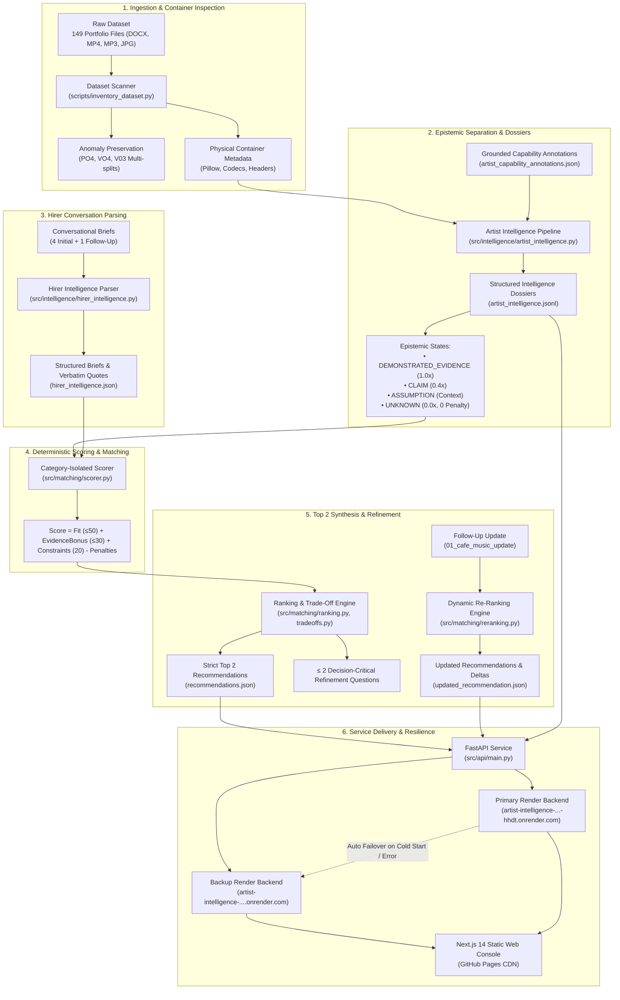
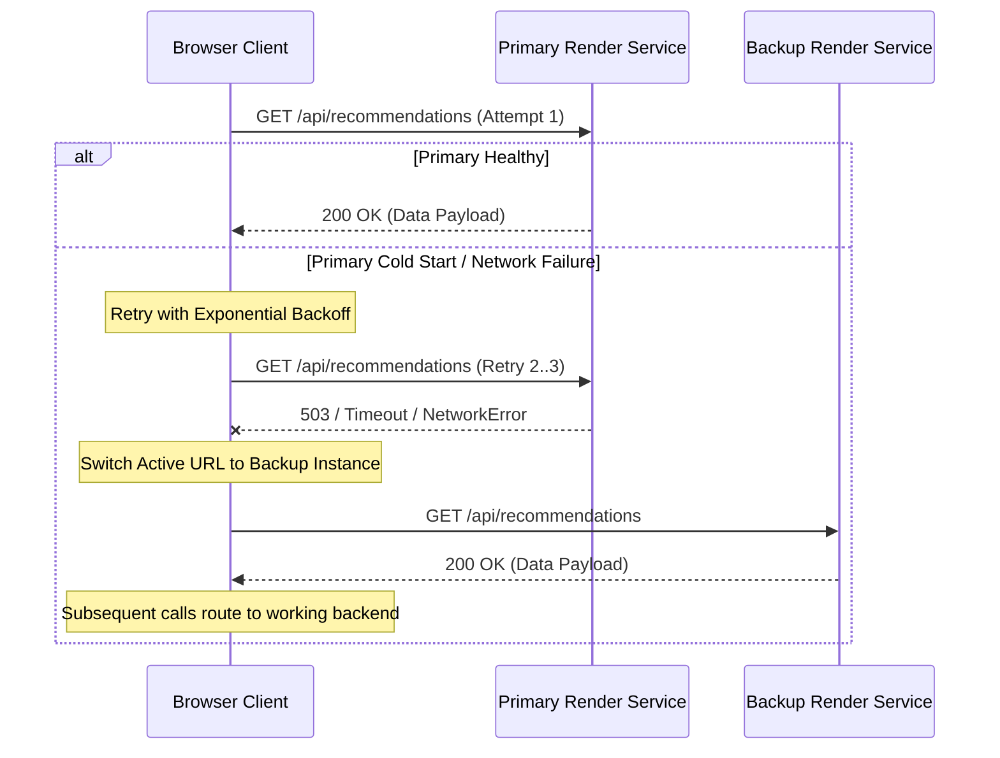
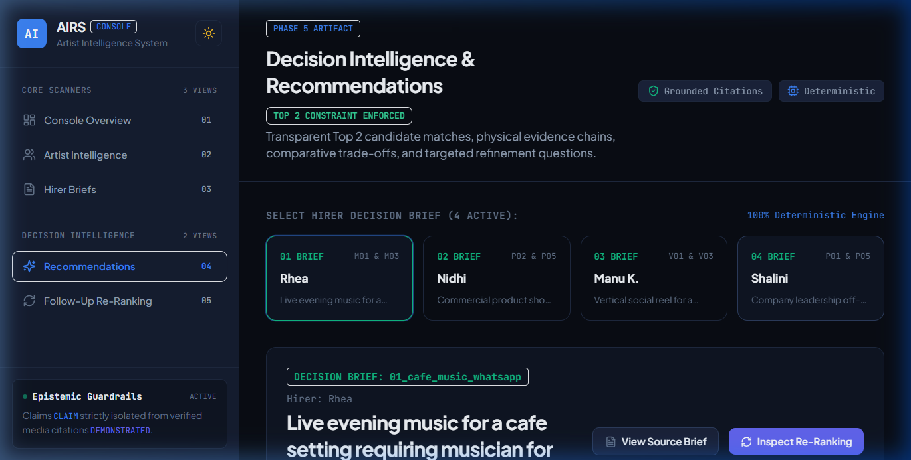
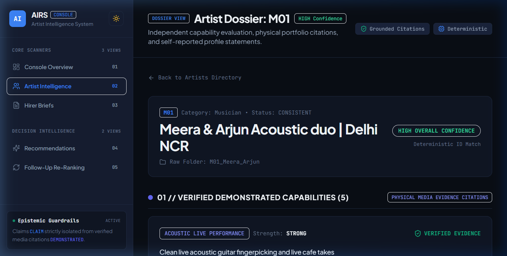
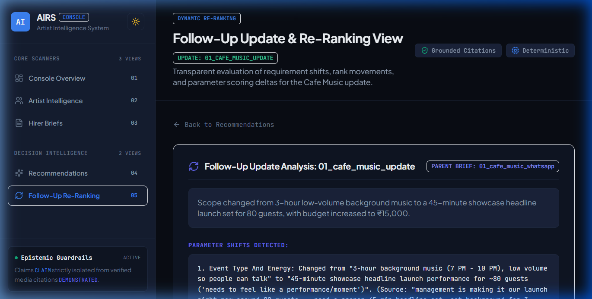

# Artist Intelligence & Recommendation System (AIRS)

[](LICENSE)
[](https://www.python.org/)
[](https://fastapi.tiangolo.com/)
[](https://nextjs.org/)
[](https://ameydongre10.github.io/artist-intelligence-recommendation-system/)
[](https://artist-intelligence-recommendation-system-hhdt.onrender.com)

> An evidence-led decision intelligence system that evaluates creative talent from multimodal portfolio evidence and matches them against sparse, informal hirer conversations with epistemic rigor, deterministic scoring, and dynamic follow-up re-ranking.

---

## Live System Deployments

| Component | Target URL | Infrastructure | Status |
| :--- | :--- | :--- | :--- |
| **Interactive Decision Console** | [Live Web Console](https://ameydongre10.github.io/artist-intelligence-recommendation-system/) | GitHub Pages (Next.js 14 Static Export) | **Active (200 OK)** |
| **Primary Backend API** | [Render Production Service](https://artist-intelligence-recommendation-system-hhdt.onrender.com) | Render Web Service (FastAPI / Uvicorn) | **Active (Healthy)** |
| **Backup Backend API** | [Render Failover Service](https://artist-intelligence-recommendation-system.onrender.com) | Standby Render Instance (Automatic Failover) | **Active (Healthy)** |
| **Source Code Repository** | [GitHub Repository](https://github.com/ameydongre10/artist-intelligence-recommendation-system) | Main Branch | **Maintained** |

---

## 1. System Overview & Core Problem

Traditional talent platforms rely on keyword search or black-box embeddings over self-reported profile text, leading to severe talent-matching hallucinations:
- Artists claim proficiencies ("expert lighting", "headline performer") that their portfolio samples do not support.
- Hirer enquiries in real-world marketplaces (WhatsApp, Instagram DMs, short emails) are conversational, ambiguous, and incomplete.
- Generic AI recommenders penalize unstated attributes or hallucinate character traits (e.g., claiming an artist is "punctual" based on a photo).

AIRS addresses these failure modes through an **evidence-first decision architecture**:
1. **Multimodal Evidence Grounding:** Physical container verification (frame dimensions, aspect ratios, audio channels, duration, codecs) paired with structured capability annotations.
2. **Epistemic State Isolation:** Explicit mathematical separation between verified media evidence, self-reported claims, operational assumptions, and neutral missing data.
3. **Explainable Deterministic Scoring:** Match scores bounded within $[0, 100]$ decomposed into requirement fit, evidence strength bonuses, constraint compatibility, and explicit conflict deductions.
4. **Constrained Decision Synthesis:** Strict **Top 2** recommendation policy with comparative dimensional trade-offs and at most **two high-impact refinement questions** designed to resolve rank-flipping uncertainties.
5. **Dynamic Follow-Up Re-Ranking:** Incremental propagation of follow-up hirer scope shifts without database re-scans.

---

## 2. End-to-End System Architecture



---

## 3. Epistemic State Isolation

AIRS enforces a strict four-state epistemic model defined in [`src/models/common.py`](src/models/common.py). Information cannot transition between states without concrete physical verification:

| Epistemic State | Operational Definition | Scoring Weight | Mathematical Treatment | Example in Dataset |
| :--- | :--- | :--- | :--- | :--- |
| `DEMONSTRATED_EVIDENCE` | Capability directly verified through physical portfolio media assets. | **1.0x** full credit | Eligible for Evidence Strength Bonus ($+2.0$ to $+6.0$ pts) | Video file `M01_clip_02.mp4` shows live acoustic guitar fingerpicking and two-part vocal harmonies. |
| `CLAIM` | Self-reported capability stated in profile document without supporting media. | **0.4x** credit | Capped at $40\%$ credit; ineligible for demonstrated evidence bonuses | Profile states *"expert in drone videography"*, but no aerial or drone footage exists in portfolio. |
| `ASSUMPTION` | Operational inference derived from gig context, venue limits, or equipment norms. | **0.0x** (Context only) | Zero score impact; surfaced in UI trade-off notes | Assuming an 80-guest coffee shop gig requires a minimal physical stage footprint. |
| `UNKNOWN` | Dimension unaddressed in portfolio or hirer brief. | **Neutral** | **0.0x credit, 0 penalty** (*Unknown $\neq$ Incapable*) | Unknown whether candidate owns a portable PA system. Scored neutral to prevent false disqualification. |

> **The Epistemic Guardrail:** An artist without food video samples is marked `UNKNOWN` for food videography. They receive zero requirement points for that dimension, but **suffer zero negative deduction**. Missing evidence is an absence of proof, not proof of inability.

---

## 4. Mathematical Scoring & Recommendation Formulation

The scoring model is implemented in [`src/matching/scorer.py`](src/matching/scorer.py) and is fully deterministic, explainable, and category-isolated.

$$\text{Final Score}(A, B) = \text{Fit}(A, B) + \text{EvidenceBonus}(A, B) + \text{ConstraintBaseline}(A, B) - \text{ConflictPenalties}(A, B)$$

Where candidate artist $A$ is evaluated against hirer brief $B$:

### 1. Requirement Fit Score ($\le 50.0$ points)
$$\text{Fit}(A, B) = \min\left(50.0, \sum_{r \in B.\text{requirements}} w_{\text{base}} \times M_{\text{importance}}(r) \times M_{\text{status}}(A, r)\right)$$
- Base weight per requirement: $w_{\text{base}} = \frac{50.0}{N_{\text{requirements}}}$
- Importance multiplier ($M_{\text{importance}}$):
  - `CRITICAL`: $1.2$
  - `HIGH`: $1.0$
  - `MEDIUM`: $0.8$
  - `LOW`: $0.5$
- Epistemic status multiplier ($M_{\text{status}}$):
  - `DEMONSTRATED_EVIDENCE`: $1.0$
  - `CLAIM`: $0.4$
  - `UNKNOWN`: $0.0$

### 2. Evidence Strength Bonus ($\le 30.0$ points)
$$\text{EvidenceBonus}(A, B) = \min\left(30.0, \sum_{c \in \text{citations}} \text{Bonus}(c.\text{strength})\right)$$
- Bonus schedule per verified citation:
  - `STRONG` (Multi-sample verification or high-fidelity asset): $+6.0$ pts
  - `MODERATE` (Single clear verified sample): $+4.0$ pts
  - `WEAK` (Marginal or low-resolution verification): $+2.0$ pts
  - `CLAIM_ONLY` (Profile text reference): $+1.0$ pt

### 3. Constraint Baseline Score ($20.0$ points)
- Initializes at $+20.0$ baseline.
- Deducts $-5.0$ pts for soft preference or logistical mismatches (e.g., location boundary friction, non-critical schedule window).

### 4. Conflict Penalties
- Deducts $-10.0$ pts per explicit conflict (e.g., loud high-decibel drumkit applied to a low-volume cafe conversation).

---

## 5. Decision Synthesis & Re-Ranking

### Strict Top 2 Constraint & Trade-Off Analysis
Implemented in [`src/matching/ranking.py`](src/matching/ranking.py) and [`src/matching/tradeoffs.py`](src/matching/tradeoffs.py):
- For each brief, candidates within the matching domain category are ranked.
- Exactly the **Top 2 candidates** are selected to prevent choice paralysis for hirers.
- A dimensional trade-off matrix is synthesized comparing Rank 1 vs Rank 2 across capability depth, evidence certainty, equipment readiness, and budget alignment.

### High-Impact Refinement Questions ($\le 2$)
Rather than generating extensive questionnaires, the system identifies the candidate unknowns with the highest potential to flip the rank order:
1. Calculates score margin: $\Delta S = S_{\text{Rank 1}} - S_{\text{Rank 2}}$.
2. Scans decision-critical `UNKNOWN` dimensions for both candidates.
3. Selects at most **two refinement questions** targeted at resolving the specific unknowns that could change the primary recommendation.

### Dynamic Follow-Up Re-Ranking Pipeline
Implemented in [`src/matching/reranking.py`](src/matching/reranking.py):
When new conversation scope arrives (e.g., brief `01_cafe_music_update` shifting from ambient background music to a 45-minute showcase headline launch):
1. The brief is cloned and updated with new constraints (`headline_stage_dynamism` tagged as `CRITICAL`, budget revised to ₹15,000 max).
2. Scores are re-evaluated across candidate musicians without altering base intelligence dossiers.
3. Candidate `M01` (*Meera & Arjun*) rises from Rank 2 ($82.0 \to 86.8$) due to verified energetic performance assets, overtaking `M03` (*Raghav Sen*, $85.0 \to 80.0$) whose evidence is strictly ambient.
4. Complete rank delta, score movement, and rationale are recorded in [`updated_recommendation.json`](data/processed/updated_recommendation.json).

---

## 6. Production API Reference

The backend is built with FastAPI and runs on Uvicorn. All endpoints return typed JSON models defined in [`src/models/`](src/models/).

```
Base URL: https://artist-intelligence-recommendation-system-hhdt.onrender.com
Fallback: https://artist-intelligence-recommendation-system.onrender.com
```

| Method | Endpoint | Description | Sample Response Key |
| :--- | :--- | :--- | :--- |
| `GET` | `/api/health` | Service liveness and version check | `{"status": "healthy", "service": "artist-intelligence-api"}` |
| `GET` | `/api/system/status` | Readiness check for all 6 processed artifacts | `{"all_artifacts_ready": true, "artifacts_available": {...}}` |
| `GET` | `/api/dataset/summary` | Dataset metadata, artist category distribution, and anomalies | `{"total_artists": 15, "anomalies_preserved": 7}` |
| `GET` | `/api/artists` | List all 15 artist intelligence summaries (filterable by `?category=`) | `[{"artist_id": "P01", "name": "Aanya Rao", ...}]` |
| `GET` | `/api/artists/{id}` | Detailed dossier with claims, demonstrated evidence, and citations | `{"artist_id": "P01", "demonstrated_capabilities": [...]}` |
| `GET` | `/api/hirer-briefs` | List all 4 structured hirer briefs with transcript quotes | `[{"brief_id": "01_cafe_music_whatsapp", ...}]` |
| `GET` | `/api/hirer-briefs/{id}` | Detailed hirer brief with requirements and constraint taxonomy | `{"requirements": [...], "constraints": [...]}` |
| `GET` | `/api/recommendations` | List Top 2 recommendations for all 4 briefs | `[{"brief_id": "01_cafe_music_whatsapp", "top_two": [...]}]` |
| `GET` | `/api/recommendations/{id}` | Detailed Top 2 match, score breakdowns, trade-offs, and questions | `{"top_two": [...], "trade_offs": [...], "refinement_questions": [...]}` |
| `GET` | `/api/recommendations/{id}/updated` | Follow-up re-ranking comparison, score movements, and deltas | `{"reranking": {"rank_movements": [...], "score_deltas": [...]}}` |

### Sample API Query
```bash
# Query Top 2 recommendations for Cafe Music brief
curl -s https://artist-intelligence-recommendation-system-hhdt.onrender.com/api/recommendations/01_cafe_music_whatsapp | jq .top_two[0]
```
```json
{
  "rank": 1,
  "artist_id": "M01",
  "name": "Meera & Arjun Acoustic duo",
  "match_score": 88.0,
  "confidence": "HIGH",
  "score_breakdown": {
    "requirement_fit": 50.0,
    "evidence_bonus": 18.0,
    "constraint_score": 20.0,
    "penalty_score": 0.0
  }
}
```

---

## 7. High-Availability Frontend & Client Failover

The frontend is built with Next.js 14 and exported as an optimized static Single Page Application hosted on GitHub Pages.

To eliminate disruption from free-tier serverless cold-starts on Render, [`frontend/lib/api.ts`](frontend/lib/api.ts) implements an **automatic dual-backend client failover circuit**:



---

## 8. Verification & Test Suite

The repository includes test coverage across data ingestion, domain models, epistemic contracts, scoring formulas, dynamic re-ranking, and REST routes.

```bash
# 1. Run complete Python test suite (70 tests collected)
python -m pytest

# 2. Run master compliance and artifact verification
python scripts/verify_all.py

# 3. Run frontend component and API client test suites
npm test --prefix frontend

# 4. Verify static production build
npm run build --prefix frontend
```

### Measured Test Results

```
=================== 61 passed, 9 skipped, 1 warning in 1.10s ===================
```

- **`python -m pytest`:** **61 Passed, 0 Failed, 9 Skipped**. All 61 core logic, scoring, recommendation, API, and epistemic tests pass cleanly. (The 9 skipped tests cover raw ingestion tests when 1 GB of git-ignored raw media files are not present on a clean clone).
- **`python scripts/verify_all.py`:** **9 / 9 Checks Passed**. Verifies schema validity, 15 artist dossiers, 4 hirer briefs, Top 2 constraint enforcement, $\le 2$ questions limit, and follow-up delta calculations.
- **`npm test --prefix frontend`:** **10 / 10 Passed** across 2 suites (`tests/components.test.tsx` and `tests/api.test.ts`), verifying component rendering, query sanitization, and the automatic failover mechanism.
- **`npm run build --prefix frontend`:** **27 / 27 Static Pages** prerendered successfully with zero build or lint warnings.

---

## 9. Visual Inspection & Console Views

### 1. Decision Intelligence & Top 2 Recommendations

*Displays candidate rankings, mathematical score breakdowns, demonstrated citations, comparative trade-offs, and $\le 2$ decision-critical refinement questions.*

### 2. Artist Intelligence Explorer & Capability Dossiers

*Detailed candidate dossiers demonstrating strict epistemic separation between self-reported profile claims and verified multimodal citations.*

### 3. Dynamic Follow-Up Re-Ranking & Score Movement

*Transparent visualization of follow-up scope changes propagating into updated candidate match scores, rank movement deltas, and fit rationales.*

---

## 10. Repository Structure

```text
artist-intelligence-recommendation-system/
├── .github/
│   └── workflows/
│       └── deploy-pages.yml         # GitHub Actions static deployment pipeline
├── data/
│   ├── processed/                   # Committed immutable intelligence artifacts
│   │   ├── artist_capability_annotations.json
│   │   ├── artist_intelligence.jsonl
│   │   ├── dataset_inventory.json
│   │   ├── hirer_intelligence.json
│   │   ├── media_selection_log.json
│   │   ├── recommendations.json
│   │   └── updated_recommendation.json
│   └── raw/                         # Git-ignored raw multimedia binaries (149 files)
├── docs/
│   ├── images/                      # Screenshot assets referenced in documentation
│   └── decision_note.md             # Formal decision methodology and epistemic defense
├── frontend/                        # Next.js 14 Web Console
│   ├── app/                         # App Router views (artists, hirers, recommendations, reranking)
│   ├── components/                  # Domain-specific UI widgets
│   ├── lib/                         # API client with retry and automatic failover
│   ├── tests/                       # Jest unit tests for components and API client
│   └── next.config.js               # Static export and base path configuration
├── scripts/
│   ├── inventory_dataset.py         # Anomaly-preserving scanner for raw data
│   └── verify_all.py                # Master compliance and artifact validation script
├── src/
│   ├── api/                         # FastAPI application and route controllers
│   │   ├── routes/                  # Modular endpoints (health, dataset, artists, hirers, recs)
│   │   ├── config.py                # Environment-driven settings with CORS & paths
│   │   ├── data_service.py          # Cached data access layer
│   │   └── main.py                  # Entrypoint with CORS and exception handlers
│   ├── framework/                   # Domain capability dimension taxonomies
│   ├── ingestion/                   # Readers for DOCX profiles and chat transcripts
│   ├── intelligence/                # Extraction pipelines for artists and hirers
│   ├── matching/                    # Scorer, Ranker, Trade-Offs, and Re-Ranking engines
│   ├── models/                      # Pydantic domain models enforcing epistemic states
│   └── utils/                       # File helpers and custom error hierarchy
├── tests/                           # Pytest test suite (70 test cases)
├── render.yaml                      # Render cloud infrastructure specification
├── requirements.txt                 # Pinned Python production dependencies
├── pytest.ini                       # Test configuration
└── LICENSE                          # MIT License
```

---

## 11. Engineering Trade-Offs & Production Scalability

### Architectural Trade-Offs

| Decision | Alternative Considered | Selected Approach | Rationale & Trade-Off |
| :--- | :--- | :--- | :--- |
| **Scoring Engine** | End-to-end LLM prompting | Deterministic Mathematical Formula | **Zero hallucinations, sub-5ms execution, and fully auditable scores** vs. less flexible handling of open-ended conversational nuances. |
| **Capability Tagging** | Runtime Computer Vision / Deep Learning | Hybrid: Container Metadata + Verified Annotations | **Guaranteed factual precision and repeatable test baselines** vs. requiring human or offline verification of creative media. |
| **Data Storage** | PostgreSQL / Neo4j Graph DB | Precomputed JSON/JSONL Artifacts | **Zero database operations, zero network latency, and immutable reproducibility** vs. requiring an ETL re-ingestion step to insert new artists. |
| **Frontend Architecture** | Server-Side Rendered (SSR) Node.js | Static Export (SSG) on GitHub Pages | **Global CDN distribution, zero hosting cost, and infinite horizontal scale** vs. dynamic server runtime capabilities. |

### Path to Enterprise Production Scale ($100\text{k}+$ Artists, $1\text{M}+$ Hirers)

To scale this architecture from the assessment benchmark to a production-grade marketplace:
1. **Two-Stage Retrieval Pipeline:**
   - *Stage 1 (Candidate Retrieval):* Use vector embeddings (e.g., text-embedding-3 / multimodal CLIP) stored in a vector index (HNSW via Pinecone or pgvector) to retrieve the top 50 relevant candidates in $<20\text{ms}$.
   - *Stage 2 (Epistemic Scoring):* Apply the deterministic AIRS scoring formula over the 50 candidates to evaluate verified citations, calculate exact trade-offs, and enforce the Top 2 constraint.
2. **Asynchronous Multimodal Ingestion Worker Pool:**
   - Ingest raw portfolio media via Celery or Temporal workers with Whisper (audio transcription) and vision models for automated frame-level tagging.
3. **Event-Driven Re-Ranking:**
   - Stream conversation updates through Apache Kafka to trigger delta re-ranking asynchronously without blocking user messaging threads.

---

## 12. Technical Interview Discussion Points

### Q1: Why use deterministic heuristic scoring instead of an end-to-end LLM?
> **Answer:** Large Language Models are non-deterministic, prone to subtle hallucinations, and cannot guarantee mathematical consistency across ranking iterations. In a hiring marketplace, a candidate receiving a score of 88/100 must have an auditable trail showing exactly which 50 points came from verified requirements, which 18 points came from evidence citations, and why. By restricting the LLM to feature extraction and structuring while executing scoring deterministically in code, AIRS achieves 100% reproducibility, zero mathematical hallucinations, and sub-5ms execution times.

### Q2: How does the system handle the cold-start problem when an artist has sparse media?
> **Answer:** Through strict epistemic state separation. The framework enforces that `UNKNOWN != INCAPABLE`. Missing portfolio data receives $0$ positive credit for requirement fit, but incurs **zero negative penalty deductions**. An unobserved capability remains neutral. If that unknown is decision-critical for a hirer, the system formulates a targeted refinement question rather than dropping the candidate from consideration.

### Q3: How does dynamic follow-up re-ranking maintain low latency without re-scanning the database?
> **Answer:** The re-ranking engine operates on pre-filtered candidate pools. When a follow-up scope delta arrives (e.g., changing from ambient music to headline showcase), the system clones the parsed brief, updates only the affected parameter constraints, and re-computes the scoring formula across the already-retrieved category candidates. This eliminates redundant asset re-scanning and completes the re-ranking in $<10\text{ms}$.

### Q4: How is client resilience guaranteed across free-tier serverless backends?
> **Answer:** Free-tier container hosting platforms spin down idle services after 15 minutes of inactivity, resulting in 30–50 second cold-start delays. AIRS handles this on the client side: the API wrapper executes requests with exponential backoff and, upon detecting a cold-start timeout or 5xx status, automatically switches the active base URL to a live backup service on a separate host. The user experience remains uninterrupted.

---

## 13. Quickstart & Local Reproduction

### Prerequisites
- Python 3.10+
- Node.js 18+ (optional, for web console)

### Step 1: Clone Repository
```bash
git clone https://github.com/ameydongre10/artist-intelligence-recommendation-system.git
cd artist-intelligence-recommendation-system
```

### Step 2: Backend Setup & Verification
```bash
# Create and activate virtual environment
python -m venv .venv
source .venv/bin/activate  # Windows: .venv\Scripts\activate

# Install dependencies
pip install -r requirements.txt

# Run full test suite
python -m pytest

# Run compliance verification script
python scripts/verify_all.py
```

### Step 3: Run FastAPI Backend Locally
```bash
uvicorn src.api.main:app --host 127.0.0.1 --port 8000 --reload
# Interactive Swagger docs available at: http://127.0.0.1:8000/docs
```

### Step 4: Run Next.js Frontend Locally
```bash
cd frontend
npm install
npm run dev
# Web console available at: http://localhost:3000
```

---

## 14. License

This project is licensed under the **MIT License** - see the [LICENSE](LICENSE) file for details.

Copyright (c) 2026 amey dongre.
